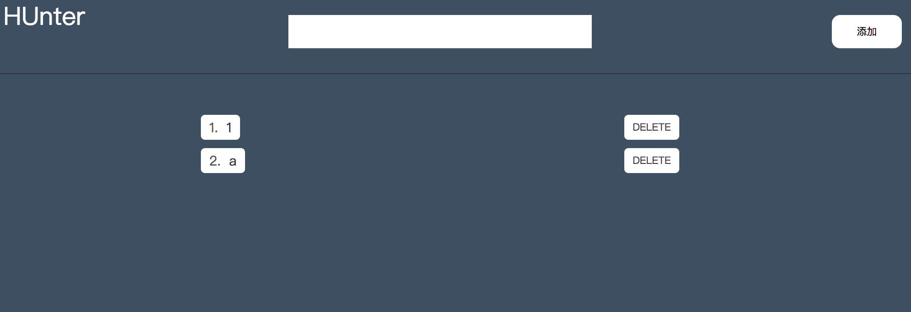

# Todo-App
一个 todoList 的 demo 应用，实现添加删除等操作。通过 node 拦截 fetch 请求，实现在前端发送请求，node 处理请求的操作，更贴近实际开发。node 端拦截请求后通过 fs 文件模块来对数据进行增删，后续会改为 MongoDB。
注：
- 这里主要说明如何通过 redux 处理异步操作。
- node 部分在这里不会做过多的说明，详情请看 [node-step](https://github.com/Hunter-Gu/node-step)。
- react 部分请看 [react](https://github.com/Hunter-Gu/TodoList/tree/master/demos/todo-mobx#react)。
- redux 基础请看 [redux](https://github.com/Hunter-Gu/TodoList/tree/master/demos/todo-redux#redux)。

## 使用
```
# webpack 编译
npm start
# 新建一个命令行窗口 commend + t
# 启动本地服务
node app.js
```

##  项目结构
```
todo-app
  |
  +------/app 处理 http 请求
  |       |
  |       +------static 处理静态资源文件
  |       +------api 处理 ajax 请求
  |       +------parse 处理 post 请求
  |
  +------/data 类似数据库的效果
  |       |
  |       +------data.json
  |
  +------/src 前端文件
  |       |
  |       +------actions redux 中的 actions
  |       +------components 应用的 展示组件
  |       +------containers 应用的容器组件
  |       +------reducers redux 中的 reducer，是纯函数
  |       +------样式 scss文件
  |
  +------app.js node入口文件
```



## 异步 Action
两个关键时刻：发送请求的时刻，接收响应的时刻／响应超时。
为此，需要三种 action：
 - 通知 reducer 请求开始的 action
  reducer 可以切换 state 中的 isFetching 告诉 UI 正在 loading
 - reducer 请求成功的 action
  接收到数据后，重置 isFetching
 - reducer 请求失败的 action
  可以保存失败的信息
```
{
  type: "FETCH_POSTS",
  status: 'success', // error
  response: { // error: 'Oops'
    // ...
  }
}
```

## 异步 Action 创建函数
Redux-thunk
```
function fetchData () {
  return function (dispatch) {
    dispatch(requestData)

    return fetch(url)
      .then(res =>{
        res.json()
          .then(res => {
            dispatch(receiveData)
          })
      })
  }
}
```
